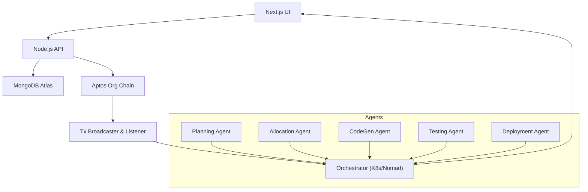

# 🚀 Zenith- Frontend

**The AI-Native, Blockchain-Secure Platform for Autonomous DevOps**

---

## 📌 About Zenith

Zenith unifies your entire software development lifecycle—planning, coding, testing, deployment, and resource allocation—into a single intelligent system. Powered by autonomous AI agents and anchored on a private Aptos blockchain, Zenith delivers seamless automation, immutable audit trails, and decentralized infrastructure to help enterprises build smarter, move faster, and trust deeper.

---

## 🎯 Key Core Features

1. **Autonomous AI Agents**

   * **Planning Agent**: Breaks down user stories into actionable tasks.
   * **Allocation Agent**: Matches tasks to team members using skills and workload analytics.
   * **CodeGen, Testing & Deployment Agents**: Generate boilerplate code, execute CI/E2E tests, and orchestrate container rollouts.

2. **Blockchain-Backed Audit Trail**

   * Every action (task creation, assignment, completion) is immutably logged on a private Aptos chain for full compliance and transparency.

3. **Unified DevOps OS**

   * Replace Jira, Jenkins, GitLab, and fragmented scripts with a single cohesive platform for end-to-end product development.

4. **Decentralized Infrastructure**

   * Leverage your own company machines as validator nodes—eliminate cloud bills, ensure sovereignty, and boost resilience.

5. **Smart Resource Allocation**

   * Predictive AI dynamically allocates compute and human resources to maximize throughput and minimize bottlenecks.

---

## 🔍 SWOL Analysis

* **Strengths**: Unified platform; on-chain transparency; AI-driven automation; cost-saving via decentralized nodes.
* **Weaknesses**: Migration complexity; potential latency from blockchain consensus; resistance from entrenched incumbents.
* **Opportunities**: Rising demand for DevOps automation; strict audit/compliance needs; expansion into governance and security modules.
* **Threats**: Atlassian/GitHub budgets; blockchain skepticism; security vulnerabilities if not robustly implemented.

---

## 🖥️ Architecture Overview



---

## ⚙️ Tech Stack

* **Frontend**: Next.js 15 · React 19 · Tailwind CSS · Framer Motion
* **Backend**: Node.js · Express · MongoDB Atlas
* **Blockchain**: Aptos (Private Org Chain)
* **AI Agents**: Dockerized Python (LangChain-based)
* **Orchestration**: Kubernetes / Nomad
* **Auth**: Civic Web3 passwordless oauth

---

## 📥 Getting Started

**Prerequisites**:

* Node.js ≥ 20, pnpm
* Docker & Kubernetes or Nomad
* MongoDB Atlas account
* Aptos CLI & local validator

**Install & Run**:

```bash
# Clone & install
git clone https://github.com/your-org/zenith.git
cd zenith/frontend
pnpm install

# Configure env
cp .env.example .env.local
# edit .env.local: NEXT_PUBLIC_API_URL, MONGODB_URI, APTOS_NODE_URL

# Start services
pnpm --filter backend dev    # API
pnpm --filter chain dev      # Aptos chain
cd frontend && pnpm dev      # Next.js UI
```

---

## 🚧 Folder Structure

```
zenith/
├── frontend/       # Next.js UI & Actions
│   ├── src/app/
│   ├── src/components/
│   └── src/actions/
├── backend/        # Node.js API & Services
├── agents/         # Dockerized AI agents
├── chain/          # Aptos modules & setup
└── docs/           # Diagrams & specs
```

---

## 🔐 Security & Compliance

* **Immutable Ledger**: Every event recorded on-chain
* **Zero-Trust Auth**: Passwordless via Civic Web3
* **Audit-Ready**: Suitable for ISO, PCI, SOX compliance

---

## 🤝 Contributing

1. Fork the repo & clone locally
2. Create branch: `git checkout -b feat/your-feature`
3. Commit changes: `git commit -m "feat: ..."`
4. Push & open PR against `main`

See [CONTRIBUTING.md](./CONTRIBUTING.md) for guidelines.

---

## 📄 License

Distributed under the MIT License. See [LICENSE](./LICENSE) for details.

---

# 📘 Zenith-Frontend

**Focused on delivering a seamless, AI‑powered UI for the Zenith platform**

## 🎯 Purpose

This repo contains the Next.js-based frontend and client-side actions that power Zenith’s intuitive user experience—from Org sign‑up, onboarding, and dashboards to real‑time task management.

## ⚙️ Tech Stack

* **Framework:** Next.js 15 · React 19 · TypeScript
* **Styling:** Tailwind CSS · Framer Motion
* **Auth:** @civic/auth (Web3 passwordless)
* **State & Data:** React Hooks · Server Actions · Next.js App Router
* **Forms & Validation:** Native Browser Validation · Custom ActionResult Types
* **Build & Package:** pnpm · Turbopack

## 🚀 Features

1. **Org Sign‑Up & Onboarding**
   Routes: `/signup`, `/onboarding`

   * Create organizations via server actions.
   * Multi‑step wizard for plan confirmation and admin setup.

2. **Protected Routes**

   * Client middleware (`src/middleware.ts`) secures app with Civic auth.
   * `GradientUserButton` for consistent user menu.

3. **Dynamic Dashboards**

   * Manager & Employee UIs under `src/app/manager` and `src/app/employee`.
   * Real‑time fetching of org, user, and task data.

4. **Reusable Components & Utilities**

   * UI: Buttons, cards, tabs, charts under `src/components`
   * Actions: CRUD operations in `src/actions`
   * Services: API calls in `src/services`

5. **Dark & Light Themes** (future)

   * Ready for theme toggling with Tailwind CSS config.

## 📥 Getting Started

```bash
# From repo root
git clone https://github.com/your-org/zenith-frontend.git
cd zenith-frontend
pnpm install
cp .env.example .env.local   # set NEXT_PUBLIC_API_URL
pnpm dev
```

Visit [http://localhost:3000](http://localhost:3000) to explore the UI.

## 🚧 Folder Structure

```
zenith-frontend/
├── src/
│   ├── app/          # Next.js pages & layouts
│   ├── components/   # Reusable UI elements
│   ├── actions/      # Server Actions interacting with services
│   ├── services/     # Client‑server API logic
│   └── lib/          # Utilities and middleware
├── public/           # Static assets
├── .env.example      # Environment variable template
└── pnpm-workspace.yaml
```

## 🤝 Contributing

1. Fork & clone
2. `pnpm install`
3. Create feature branch
4. Commit & push
5. Open PR against `main`

Refer to the main [CONTRIBUTING.md](../CONTRIBUTING.md) for broader project guidelines.
